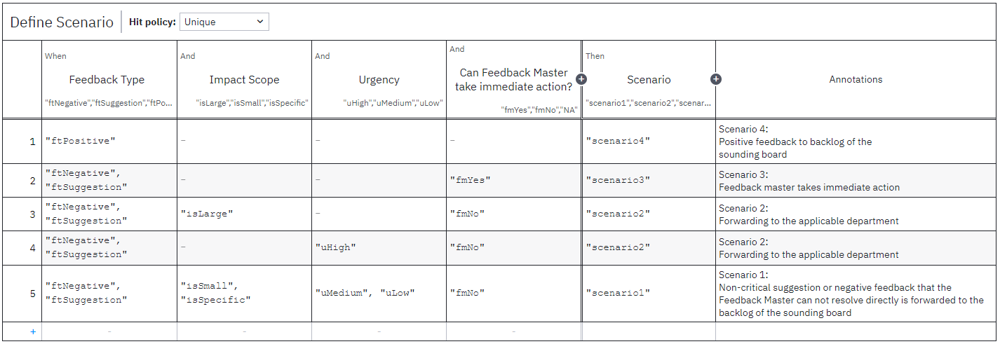

# Feedback-Handling Scenarios  

SVK’s BPMN model delegates the routing decision to a **DMN decision table** named *Define Scenario*.  
Using the Feedback Master’s classification (`feedbackType`, `impactScope`, `urgency`, and `immediateAction`), the table returns one of four scenarios that determine the subsequent path in the process.

| Scenario | Trigger conditions (simplified) | Follow-up path |
|----------|---------------------------------|----------------|
| **Scenario 1** – Non-critical backlog item | `ftNegative` or `ftSuggestion` **and** `impactScope` ∈ {`isSmall`,`isSpecific`} **and** `urgency` ∈ {`uMedium`,`uLow`} **and** `immediateAction = fmNo` | Case is placed on the Review-Board backlog for periodic discussion. |
| **Scenario 2** – Department action required | (`impactScope = isLarge` **or** `urgency = uHigh`) **and** `ftNegative` or `ftSuggestion` **and** `immediateAction = fmNo` | A Department Measure task is sent to the responsible unit; reminders every 3 days until completion. |
| **Scenario 3** – Immediate resolution by Feedback Master | `ftNegative` or `ftSuggestion` **and** `immediateAction = fmYes` | Feedback Master documents the corrective measure directly, then proceeds to closure. |
| **Scenario 4** – Positive feedback | `ftPositive` | Item is logged for bi-weekly Review-Board acknowledgement and potential publication. |

> The **Classification Guardrails** (see *Classification Guardrails.md*) support the Feedback Master in making consistent selections for each input column.
